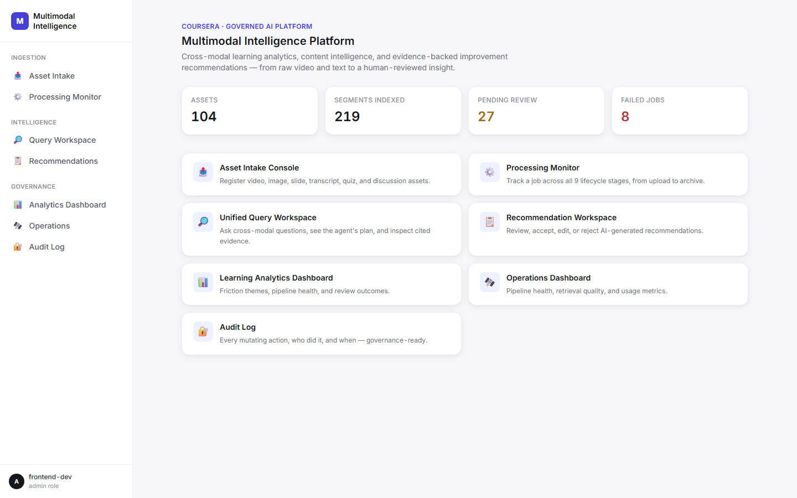
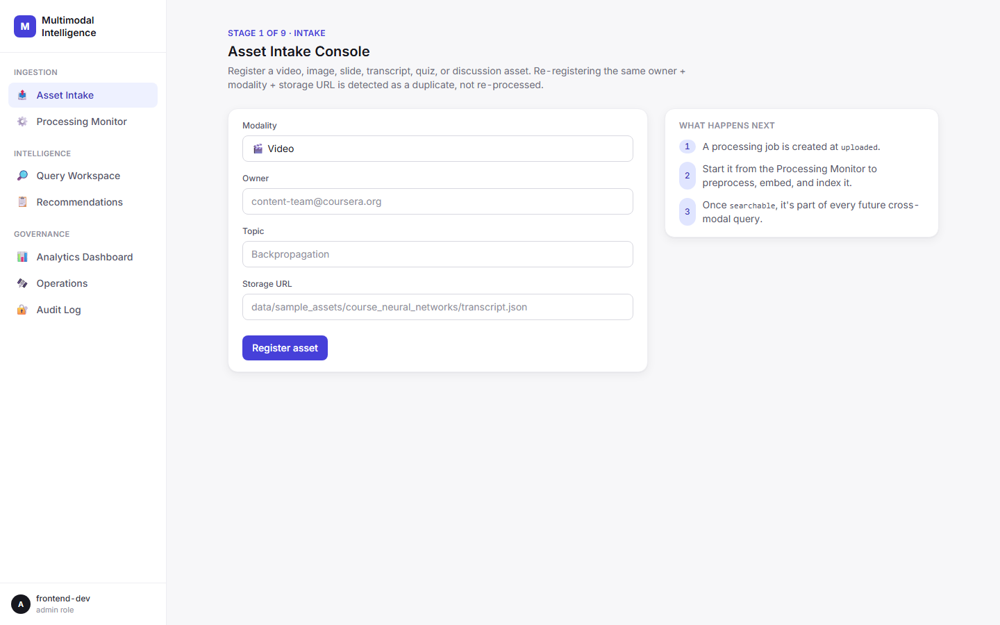
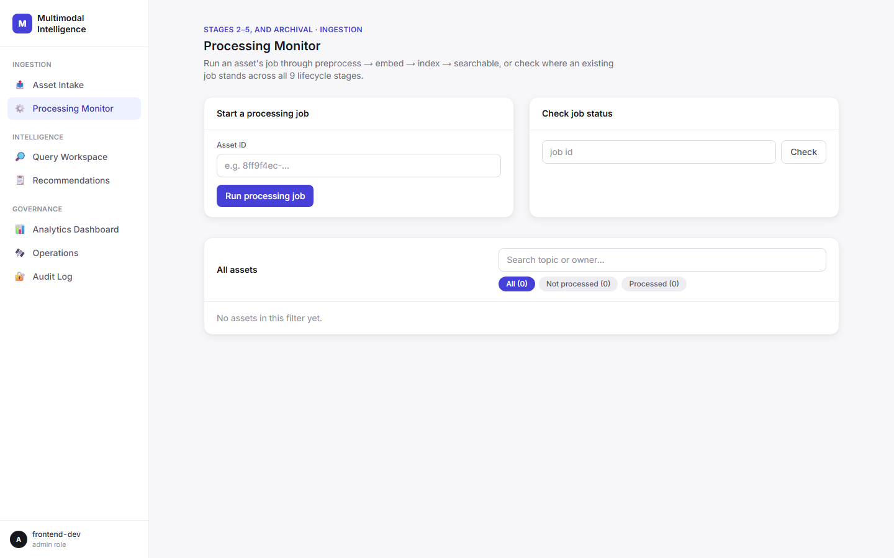
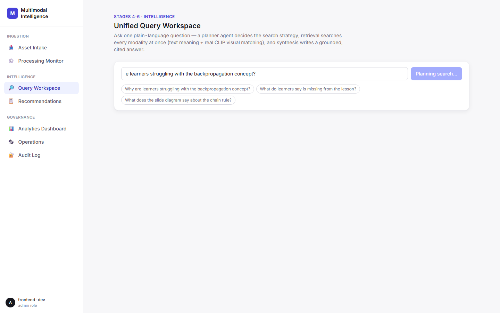
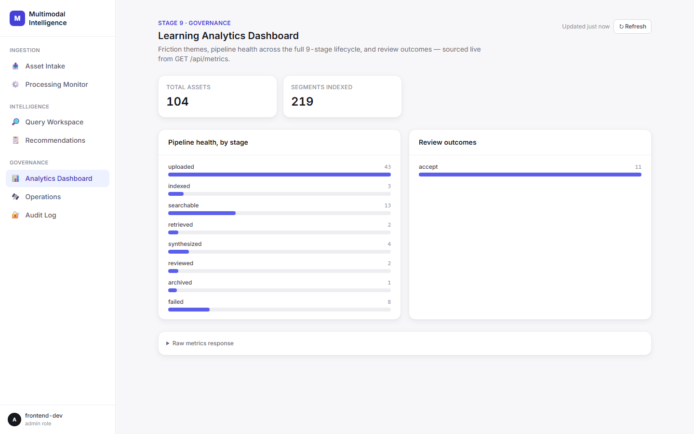
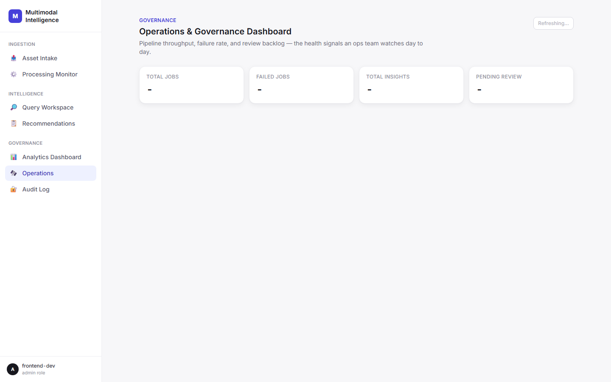
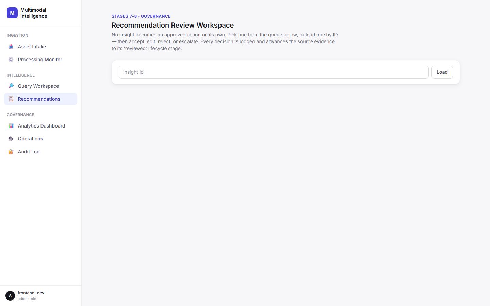
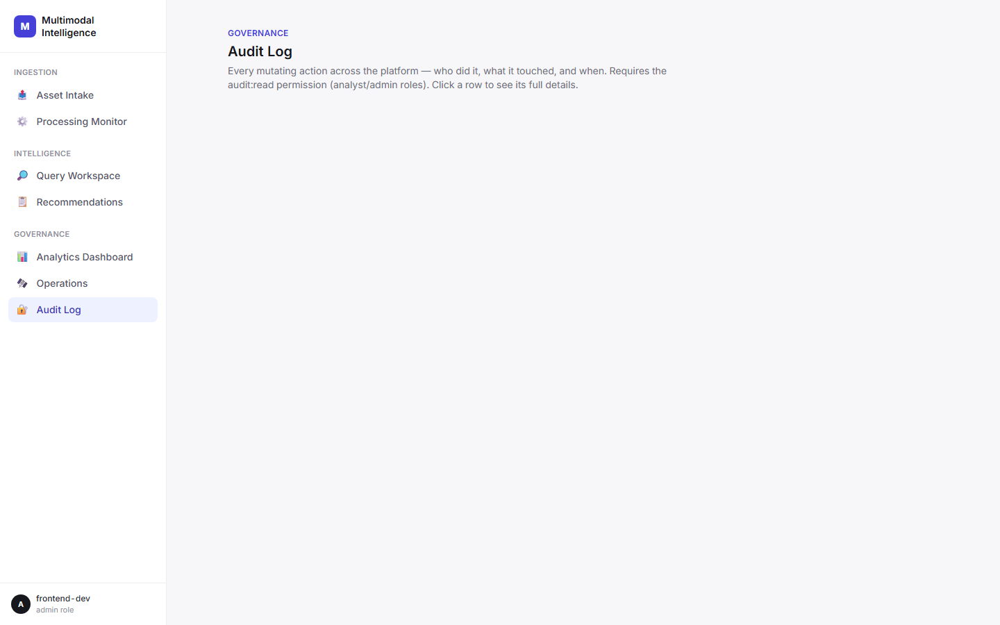

# Coursera Multimodal Intelligence Platform

A governed AI platform for cross-modal learning analytics, content intelligence,
and evidence-backed improvement recommendations. Built against the product
brief's specification: input (video/image/text/quiz/slide/discussion) →
preprocessing → embeddings → unified query → retrieval → LLM synthesis →
human review.

## Repository structure

This repo follows the structure specified in the product brief §7.1. Backend
API routes match §7.3 exactly; everything else follows the brief's intended
folder responsibilities, with implementation details (frameworks, extra
helper modules) filled in where the brief left them open.

```
├── frontend/     # Next.js product UI — dashboards, query workspace, evidence panel
├── backend/      # FastAPI service — asset/job/query/synthesis/review APIs (§7.3)
├── ai/           # Embedding generation, retrieval ranking, LLM synthesis, prompts, eval
├── pipelines/    # Modality-specific preprocessing: video, image, text, indexing
├── data/         # Sample assets, schemas, sample queries, evaluation cases
├── docs/         # Architecture notes, API docs, deployment guide, demo script, screenshots
├── tests/        # Functional, retrieval, AI-output, and edge-case tests
└── deployment/   # Vercel/backend hosting notes, environment setup
```

## Status

Everything below has been **run for real**, not just written: real Supabase
Postgres+pgvector database, real OpenAI embeddings/synthesis, real HTTP
requests against a running backend, real browser sessions against a running
frontend.

| Folder | Status |
|---|---|
| `backend/` | 15 API routes (the original 9 plus `POST /api/processing-jobs/{id}/archive`, `GET /api/audit-log`, `GET /api/assets`, `GET /api/assets/check-storage`, `GET /api/insights`, and `GET /api/segments/{id}`), all verified over live HTTP with a real signed JWT. Real auth (HS256, `PyJWT`) **plus RBAC** — `require_role_permission()` gates every mutating route by role, verified returning `403` for an out-of-scope role, not just `401` for no token. Every mutating route also writes to `audit_log`. `POST /api/processing-jobs` runs the full pipeline synchronously, advancing a job through all applicable stages of the full 9-stage lifecycle (`uploaded → … → searchable`), verified over HTTP. CORS enabled for the frontend origin. |
| `frontend/` | Next.js app, fully redesigned (sidebar nav, component kit, Inter typeface) with 7 product surfaces including a new Audit Log page, driven end-to-end with Playwright against the live backend — asset registration, agent-pipeline-transparent querying, review, dashboards, all confirmed rendering with real data and zero console errors. Clean production build. |
| `ai/` | Preprocessing, **dual-channel embeddings** (OpenAI text + local CLIP visual), permission-aware retrieval, **a real agent pipeline** (`ai/agents/`: retrieval planner, evidence ranker, quality validator) wrapping LLM synthesis with citations — proven producing grounded, cross-modal (text **and** visual), cited answers against real seeded data. |
| `pipelines/` | Text/discussion/quiz cleaning, slide-PDF extraction (PyMuPDF), video (ffmpeg + Whisper), and image OCR (tesseract) all run for real — verified processing a real generated video and a real generated image end to end. `ffmpeg`/`tesseract` are external system binaries, not Python packages; install separately if missing (see `pipelines/README.md`). |
| `data/` | Hand-authored demo course (backprop, all 6 modalities) + real data pulled live from Hugging Face (`data/scripts/fetch_datasets.py`) — both seeded into the live database. |
| `docs/` | Architecture, API documentation (both updated for the agent/RBAC/audit-log/CLIP additions), deployment guide, demo script, plus two new self-contained HTML walkthroughs: `how_the_platform_works.html` (non-technical, big diagrams) and `codebase_flow_walkthrough.html` (engineering onboarding — real endpoints, prompts, and call chains). |
| `tests/` | 15 pytest tests (functional/retrieval/AI-output/edge-case, including new RBAC and lifecycle coverage) + 11 Playwright browser tests, all passing against the live database and live frontend. |
| `deployment/` | **Deployed and live** — backend on Render (Docker, `backend/Dockerfile`), frontend on Netlify. See [Live Deployment](#live-deployment) below. |

**Known, deliberate gaps:** no demo video yet, no Alembic migrations (schema managed by `create_all()` + explicit `ALTER TABLE ... IF NOT EXISTS` statements), real cloud object storage untested (the abstraction exists in `storage_service.py`, but only its local-filesystem backend is actually exercised — no `OBJECT_STORAGE_URL`/`KEY` configured in this environment), and a known security issue: the frontend's admin JWT is baked into the public Netlify JS bundle at build time (see [Live Deployment](#live-deployment)) — fine for a demo, not acceptable before any real user data goes through it. Render's free tier also intermittently 502s ("no active deployment") after periods of inactivity, which the frontend surfaces as failed fetches rather than a friendly retry state.

## Live Deployment

| Service | URL |
|---|---|
| Frontend (Netlify) | https://courseramip.netlify.app |
| Backend API (Render) | https://coursera-multimodal-intelligence-platform.onrender.com |

Both are real deployments, not tunnels into a local machine — verified end to end with Playwright against the production URLs (CORS, auth, and data flow all confirmed working live).

**Known issue — exposed token:** the frontend authenticates using a long-lived admin JWT passed via `NEXT_PUBLIC_BACKEND_TOKEN`. Next.js inlines all `NEXT_PUBLIC_*` env vars into the client-side JS bundle at build time, so this token is publicly readable by anyone who opens the deployed site's JS. This is acceptable for a demo/portfolio deployment with no real user data behind it, but would need to be replaced with a real login flow (or at minimum a heavily scoped-down, short-lived token) before handling anything sensitive.

**Known issue — Render free-tier memory limit:** the backend runs on Render's free tier (512MB RAM), which is tight once the local CLIP model (`sentence-transformers`) is loaded alongside FastAPI/SQLAlchemy. Under memory pressure Render OOM-kills and restarts the instance, which briefly surfaces as a `502` with no active deployment until it comes back on its own. If the live demo looks broken (stat tiles showing `—`, "Failed to fetch" on a query), this is almost always the cause — check the Render dashboard's metrics tab for a memory/restart event.

## Screenshots

Captured from the live deployment (`docs/screenshots/`):

| | |
|---|---|
|  Home |  Asset Intake Console |
|  Processing Monitor |  Unified Query Workspace |
|  Analytics Dashboard |  Operations Dashboard |
|  Recommendation Workspace |  Audit Log |

## Team Contribution

_TODO: fill in team member names and areas of contribution._

## Design principle

Every generated insight must retain source lineage (asset ID, segment ID,
modality, timestamp) back to the original video, image, slide, transcript,
quiz, or discussion evidence it was built from. No recommendation is treated
as operationally approved until a human reviewer accepts it.

## Getting started

Each top-level folder has its own README. To run the full stack locally, see
`deployment/environment_setup.md` — it starts the backend (which pulls in
`ai/` and `pipelines/`) and the frontend together. To see the intended user
flow end to end, read `docs/demo_script.md`.
