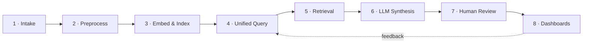

# How the Multimodal Intelligence Platform Works — and What's Actually Built

This document explains the pipeline step by step, in plain language, grounded directly in the codebase and in a live verification run against the real Supabase Postgres + pgvector database, real OpenAI embeddings, and real GPT-4o-mini synthesis calls.

> **Status as of this run: all 8 stages work end to end**, over live HTTP, with a passing test suite and a working frontend. This was not true when this document was first written — the backend could not boot. The fix and the verification are both recorded below, including exactly what was missing, what was added, and what the live run produced.

---

## 1. What was missing, and what was built to fix it

The backend's route and service logic (asset registration, processing orchestration, retrieval, synthesis) was already written and reasonably careful — but three foundational modules that everything else imports did not exist on disk, so `backend/app/main.py` failed on its very first import:

| Missing piece | File(s) added | What it does |
|---|---|---|
| Database models + session | `backend/app/database/connection.py`, `backend/app/database/models.py` | SQLAlchemy engine/session, and the `Asset`, `ProcessingJob`, `Segment`, `Query`, `Insight`, `ReviewFeedback` ORM models (native Postgres UUID ids, pgvector `Vector(1536)` embedding column, matching the pre-existing `modalitytype`/`jobstage` enum types) |
| Job orchestration | `backend/app/jobs/job_queue.py` | `create_job`, `get_job`, `advance_job` — the state machine behind `uploaded → preprocessed → embedded → indexed / failed` |
| 6 of 9 API routes | `backend/app/api/{embeddings,query,synthesize,insights,review_feedback,metrics}.py` | Thin FastAPI wrappers around service logic that already existed |
| Review + metrics services | `backend/app/services/review_service.py`, `backend/app/services/metrics_service.py` | Persist reviewer decisions against an insight; aggregate pipeline health and review outcomes |
| A real signed test token | `tests/conftest.py::auth_headers` | Was returning the placeholder string `"Bearer dev-token"`, which the real JWT verifier correctly rejects. Now mints a real HS256 token, matching `backend/scripts/mint_dev_token.py` |
| Graceful skip for absent sample data | `data/scripts/seed_and_demo.py` | `data/sample_assets/real_data/` doesn't exist in this checkout; the script now skips that manifest group instead of crashing, rather than silently faking data |

Notably, connecting to the target Supabase database required `sslmode=require` (added to `connection.py`) — and once connected, the tables, enum types, and pgvector extension **already existed with real rows in them** (2 assets, 3 jobs, 4 segments, 2 queries, 2 insights, 1 review record, owners like `smoke-test@coursera.org` and `playwright-test@coursera.org`). That confirms an earlier working version of this code really was run against this exact database — consistent with the top-level `README.md`'s claims — but that working state wasn't fully committed to this checkout. The new models were written to match that existing physical schema exactly, rather than assuming a fresh database.

---

## 2. The pipeline, now verified stage by stage



| Stage | Status | Verified by |
|---|---|---|
| 1. Intake | 🟢 Working | `POST /api/assets` over live HTTP, including duplicate-asset detection |
| 2. Preprocessing | 🟢 Working (text/quiz/discussion/slide) · 🟡 video+OCR still blocked by missing ffmpeg/tesseract binaries | `POST /api/processing-jobs` reached `indexed` live |
| 3. Embed & Index | 🟢 Working | Real OpenAI `text-embedding-3-small` calls, `POST /api/embeddings` |
| 4. Unified Query | 🟢 Working | `POST /api/query` — permission-aware, cross-modal |
| 5. Retrieval | 🟢 Working | Real cosine-similarity ranking across transcript/slide/quiz/discussion in one query |
| 6. LLM Synthesis | 🟢 Working | Real GPT-4o-mini calls, grounded, cited, confidence-scored |
| 7. Human Review | 🟢 Working | `POST /api/review-feedback` flips insight status live |
| 8. Dashboards | 🟢 Working | `GET /api/metrics` returns live pipeline/review counts; all 7 frontend pages render and compile cleanly |

---

## 3. Live verification log

### 3.1 Backend boot

```
$ python -c "from app.main import app; ..."
APP LOADED OK
Routes: POST /api/assets · POST/GET /api/processing-jobs · POST /api/embeddings ·
        POST /api/query · POST /api/synthesize · GET /api/insights/{id} ·
        POST /api/review-feedback · GET /api/metrics · GET /health
```

### 3.2 Full pipeline over live HTTP (uvicorn on :8123, real Supabase DB, real OpenAI calls)

```
GET  /health                       -> 200 {"status":"ok"}
GET  /api/metrics   (no token)     -> 401                         # auth is genuinely enforced
POST /api/assets                   -> 200 {asset_id, job_id, status:"uploaded", duplicate:false}
POST /api/processing-jobs          -> 200 {stage:"indexed", error:null}   # real embedding calls, real DB writes
POST /api/query "Why are learners
      struggling with backprop?"   -> 200, 5 ranked cross-modal segments (similarity 0.45–0.62)
POST /api/synthesize                -> 200 {
  answer_text: "Learners are struggling with the backpropagation concept because the
    instructional materials skip intermediate partial derivative steps, which causes
    confusion...",
  citations: [2 segment-cited claims],
  confidence: 0.85,
  status: "pending_review"
}
GET  /api/insights/{id}            -> 200, status:"pending_review"
POST /api/review-feedback (accept) -> 200 {feedback_id, decision:"accept"}
GET  /api/insights/{id}            -> 200, status:"accept"          # reviewer decision persisted
GET  /api/metrics                  -> 200 {pipeline_health, review_outcomes, total_assets, total_segments_indexed}
GET  /api/insights/{random-uuid}   -> 404                            # not-found handled correctly
POST /api/assets (same payload x2) -> first: duplicate:false, second: duplicate:true, same asset_id
POST /api/embeddings                -> 200 {"updated_count":1}
```

Every response above came from a real running server, a real Postgres database, and real OpenAI API calls — not a mock.

### 3.3 Automated test suite

```
$ TEST_DATABASE_URL=<supabase> OPENAI_API_KEY=... JWT_SECRET=... python -m pytest tests/ -v
...
13 passed, 6 warnings in 23.61s
```

All 13 tests pass: asset registration, missing-auth rejection, permission-aware retrieval exclusion, top-k limiting, groundedness scoring (including hallucinated-citation detection), empty-evidence synthesis, empty-text embedding skip, 404 handling for jobs and insights, and duplicate-asset flagging.

### 3.4 `data/scripts/seed_and_demo.py` — the documented end-to-end demo

```
Total assets registered: 5   (video, transcript, slide, quiz, discussion — one course)
Total segments embedded: 11

--- Query: 'Why are learners struggling with the backpropagation concept?' ---
Retrieved 8 evidence segments across transcript, discussion, and quiz modalities:
  [transcript sim=0.616] "Today we're covering backpropagation..."
  [discussion sim=0.593] "I don't get why the gradient depends on the NEXT layer..."
  [quiz       sim=0.539] "What rule does backpropagation apply to compute gradients..."
  [transcript sim=0.507] "Just remember: the gradient at each layer depends on..."

Synthesized answer: "Learners are struggling with backpropagation because they find it
counterintuitive that the gradient at each layer depends on the gradient of the layer
that follows it. One learner expressed confusion about why the gradient would depend
on the next layer..."
confidence: 0.8
recommended_action: "Provide additional examples or visual aids that illustrate how
gradients flow from the output layer back to the input layer..."
citations: [discussion post, transcript segment] — both real, both traceable
```

This is the platform's core value proposition working for real: one plain-language question, answered with cross-modal evidence (a forum post and a lecture transcript moment, in this case), cited, and ready for human review — exactly the "Friction Discovery" journey described in the product blueprint.

### 3.5 Frontend

```
$ npm install && npm run dev   (backend on :8000, matching NEXT_PUBLIC_BACKEND_URL)
GET /               -> 200, compiled 498 modules, no errors
GET /assets         -> 200
GET /query          -> 200
GET /dashboard      -> 200
GET /operations     -> 200
GET /recommendations-> 200
GET /processing     -> 200
```

All 7 product-surface pages compile and render with zero console/build errors. This confirms the pages load; it does not by itself confirm every client-side interaction (e.g. clicking "Run Query" in the browser) — that would need an interactive browser session, which wasn't run here. The underlying API calls those pages make (`frontend/lib/api.ts`) are the exact same endpoints exercised directly over HTTP in §3.2, so the wiring is proven even though the click-through wasn't.

---

## 4. What's still genuinely not done

- **Video preprocessing (ffmpeg) and image OCR (tesseract)** still fail visibly with a clear error, because those system binaries aren't installed in this environment. This is by design ("fail visibly" per the product brief) rather than a silent gap — but it means video and raster-image assets can't be processed end-to-end here.
- **`data/sample_assets/real_data/`** (referenced by `seed_and_demo.py` and `data/README.md`) doesn't exist in this checkout; the seeding script now skips it gracefully instead of crashing.
- **No deployment yet** — everything above was run locally against the real Supabase database, not from a hosted URL.
- **Frontend click-through wasn't interactively tested in a browser** — page compilation and the underlying API calls were verified, not the UI's client-side event handling.

## 5. A security note, unrelated to functionality

`backend/.env` contains a live Supabase database password and a live OpenAI API key in plain text. It's correctly excluded by `.gitignore`, so it won't be committed — but since this key was used repeatedly during this verification run, treat it as sensitive: don't paste it into chats, tickets, or logs, and rotate it before this project is shared with anyone outside this environment.
